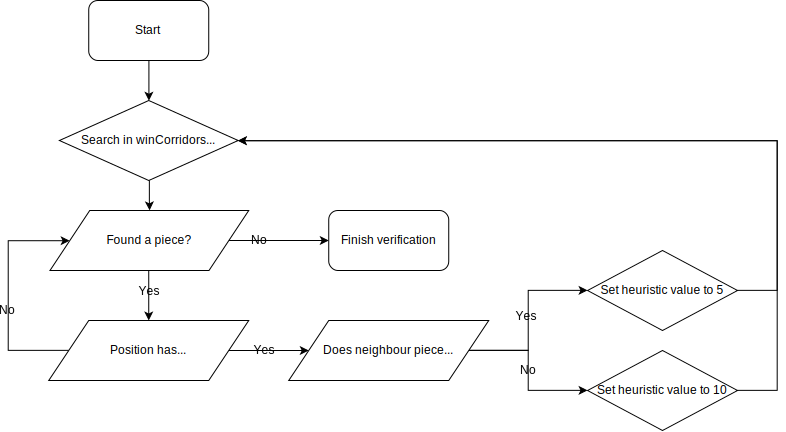

# ShooterGame.exe - a ColorShapeLinks A.I.

## Authors
The following project was developed by the following students:
* [André Pedro](https://github.com/andre-pedro) - a21701115
* [Diogo Maia](https://github.com/IssaMaia) - a21901308
* [Tiago Alves](https://github.com/Synpse) - a21701031

## Task Distribution

* **André Pedro**
    * Report Elaboration
    * Research
* **Diogo Maia**
    * Negamax Algorithm
    * Scores
* **Tiago Alves**
    * A.I. Base
    * Verifications

## Developed Solution

### Implemented Algorithm

To develop our A.I. we used the "[Negamax]" algorithm, a simplified version of the "[Minimax]" algorithm that's the most efficient for our kind of game (a two-player zero-sum game).

Negamax is a simplified minimax variant, where each node (regardlessly of being a MIN or MAX) obtains the maximum value of their children (as if everyone in the node was a MAX), but what differenciates it is the fact that the MAX nodes are changed (instead of using minimum and maximum values, "Negamax" just uses the MAX, but with changed values).

### Chosen Heuristic

Our chosen static evaluation function (Heuristic) consists in going through `winCorridors` (a read-only public class avaliable from the professor's Unity project included in the assignment), composed of a collection that contains all the sequences of positions where favourable or winning sequences might exist.
Then, the Heuristic will check if a `winCorridors` position has a neighbour (a game piece present in that position). If the neighbour piece belongs to the player, it will get the value "5". If it belongs to the enemy A.I., it will get the value "10".

## References
[Millington, I. (2019). AI for Games (3rd ed.). CRC Press.](https://www.taylorfrancis.com/books/9781351053303)

[NegaMax Pseudo-code](https://www.researchgate.net/figure/NegaMax-Algorithm-Pseudo-Code_fig3_262672371)

[Negamax]:(https://en.wikipedia.org/wiki/Negamax)
[Minimax]:(https://en.wikipedia.org/wiki/Minimax)